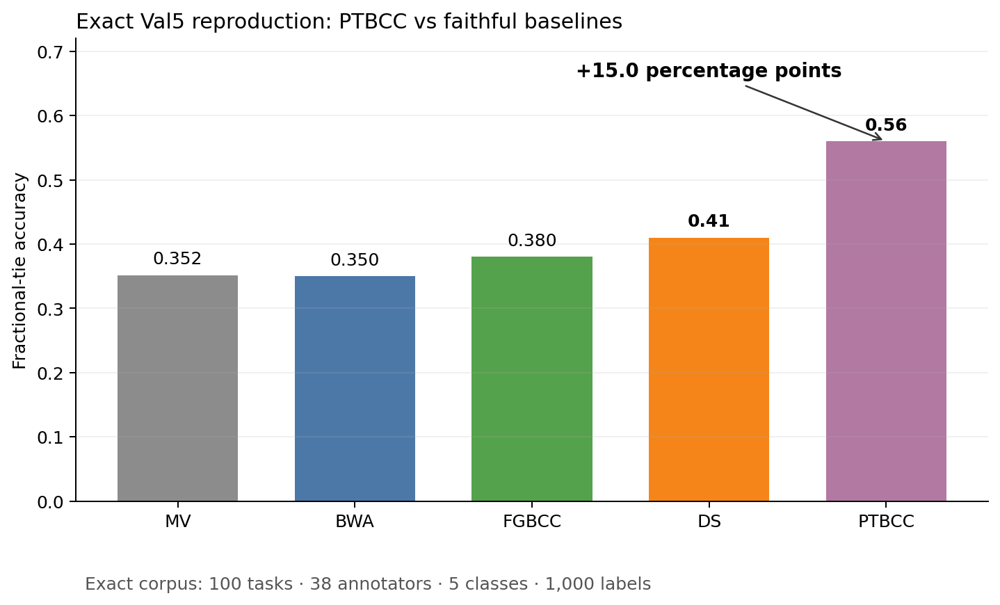
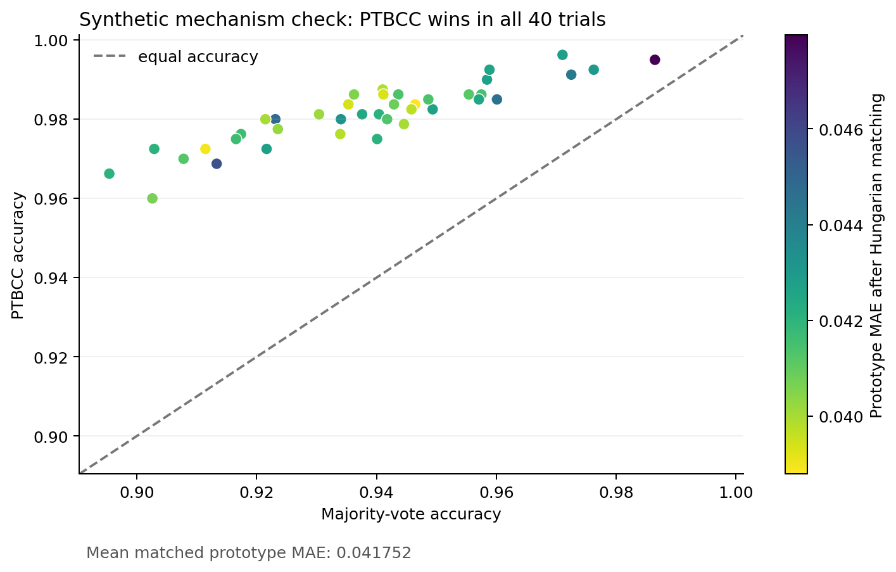
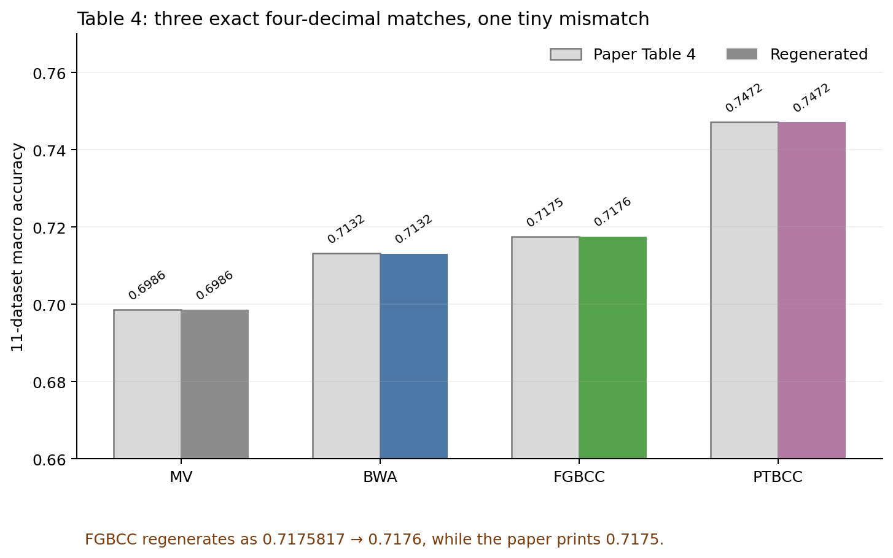
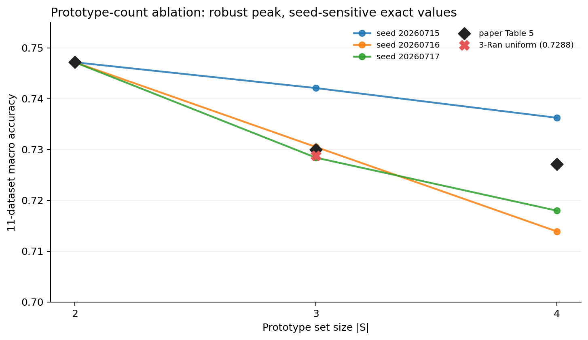
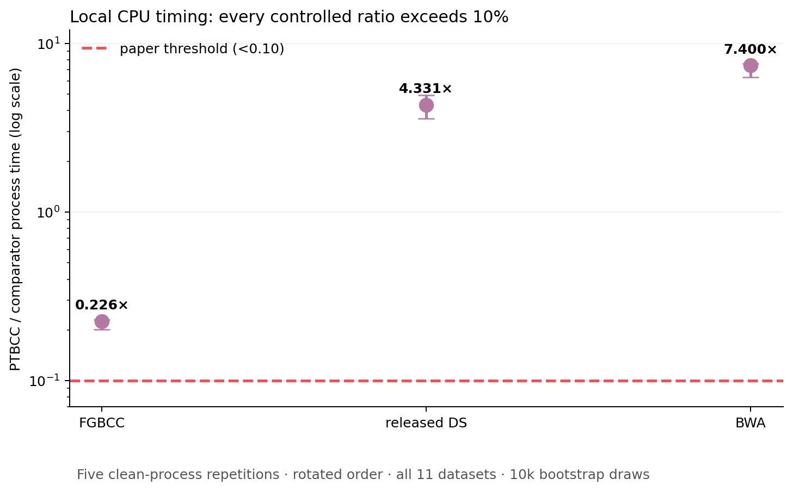

# PTBCC claim-by-claim reproduction



*Strongest result.* On the exact Val5 corpus, reconstructed PTBCC reaches
`0.56` accuracy and the released Dawid–Skene baseline reaches `0.41`. This
directly reproduces the paper's largest reported gain: `+15.0` percentage
points.

## The question

Crowdsourcing datasets are sparse: each annotator labels only a small fraction
of the tasks. A conventional confusion-matrix model tries to estimate a full
matrix for every annotator, even when few observations support it. PTBCC asks
whether annotators can instead share a small set of prototype confusion
matrices, with each annotator represented by a mixture over those prototypes.

This reproduction audits five claims from arXiv `2508.02123` on the exact 11
datasets in the paper. It reconstructs PTBCC equations (7)–(14), runs
author-released or paper-referenced baselines, and treats a claim as full-credit
only when the exact quantified statement is verified or falsified.

| Claim | Paper statement | Direct observation | Verdict |
|---|---|---|---|
| 1 | Annotators share prototype confusion matrices | Two normalized `[K,K]` prototypes plus normalized per-annotator mixtures; 40/40 synthetic recovery wins | **VERIFIED** |
| 2 | Up to 15-point gain on Val5 | `0.56 − 0.41 = 0.15` | **VERIFIED** |
| 3 | 11-data macro: PTBCC `.7472`, FGBCC `.7175`, BWA `.7132`, MV `.6986` | Three match at four decimals; FGBCC regenerates `.7176` | **BLOCKED** |
| 4 | Accuracy peaks at `S=2`, then `.7300`/`.7271` at `S=3`/`S=4` | `S=2` peaks in all three seeds; exact stochastic values are seed-sensitive and the paper seed is absent | **BLOCKED** |
| 5 | About +3 points using under 10% of confusion-matrix runtime | +`2.9571` points; local PTBCC/FGBCC CPU ratio `0.2258` | **BLOCKED** |

`BLOCKED` here is deliberate. It means the local experiment is complete but
the paper omits information needed to verify or falsify its exact statement.
It does not mean the available observations were discarded.

## What was implemented

The important path is compact:

1. `load_paper_datasets()` downloads commit-pinned label/truth files and rejects
   any corpus whose Table 3 dimensions differ.
2. `fit_ptbcc()` initializes two shared prototype matrices, alternates the
   paper's variational updates, and returns truth probabilities, prototype
   matrices, and annotator mixture weights.
3. Majority vote uses fractional credit for tied maxima. BWA follows its
   released implementation; Dawid–Skene follows the survey's fixed 20-iteration
   code; FGBCC is an equation-preserving vectorization checked against the
   authors' exact Aircr output.
4. An independent process reads only the emitted CSV/JSON files, recomputes all
   claim statistics, and mutates one input per claim. The run exits nonzero if
   evidence is incomplete or a negative control is not rejected.

The central parameterization is:

```text
shared prototypes:        [S, K, K]
annotator mixture weights: [W, S]
task truth probabilities:  [N, K]
```

This differs from learning `[W, K, K]` independent annotator confusion
matrices. The checker confirms every probability row is finite and normalized.



All 40 model-matched synthetic trials improve on majority vote. The mean
prototype error after Hungarian permutation matching is `0.0417523`. This
supports the reconstructed mechanism; it is not substituted for any real-data
accuracy claim.

## Exact real-data accuracy

All 11 datasets match the paper's item, annotator, class, label, and
ground-truth counts. The full macro calculation is an unweighted mean of
per-dataset fractional-tie accuracies.



MV (`0.6986048`), BWA (`0.7131503`), and PTBCC (`0.7471525`) reproduce the
paper's four-decimal values. FGBCC reproduces the authors' Aircr golden output
exactly, but its full macro is `0.7175817`, which rounds to `0.7176` rather than
the paper's `0.7175`. The absolute discrepancy is `0.0000817`.

That small difference is not hidden, and it is not enough to call the paper
value false: PTBCC code, the paper's complete numerical environment, and the
origin of the printed FGBCC average are unavailable. Because Claim 3 is a
four-number conjunction, its final verdict is `BLOCKED`.

## Prototype-count sensitivity

The paper says two prototypes are best and attributes degradation at larger
sets to sparser evidence per prototype. We reran every dataset at `S=2,3,4`,
using three committed Dirichlet seeds plus the separate `3-Ran` uniform-matrix
control.



`S=2` is the peak in every tested seed, so the qualitative ordering is robust.
The exact `S=3` and `S=4` macros are not: they range from `0.7284–0.7421` and
`0.7139–0.7362`, respectively. No tested seed produces both printed values,
and the paper supplies no seed. Claim 4 therefore remains `BLOCKED` at the
exact-number level.

## Efficiency under controlled local CPU timing

Each method ran in a clean Python process five times across all 11 datasets.
Method order rotated, data loading occurred before the timer, wall and process
CPU clocks were retained, predictions had to remain unchanged, and intervals
used 10,000 deterministic bootstrap draws.



On this Apple CPU stack, every implemented ratio is above the paper's `0.10`
threshold. PTBCC/FGBCC process time is `0.2258` with bootstrap interval
`[0.2007, 0.2294]`; PTBCC is `4.3311×` released DS and `7.4005×` BWA. The
accuracy side of the statement does align: PTBCC is `2.9571` percentage points
above FGBCC.

This is a rigorous, repeated contradiction on the authorized local stack, but
not a paper-level falsification. The paper used a 2-vCPU Intel Xeon Platinum
8369HC, gives no raw timings or aggregate denominator, and its plot reflects
original baseline loops rather than the validated vectorized FGBCC used here.
Claim 5 is therefore `BLOCKED`.

## Negative controls and reproducibility

The independent checker rejected all five corruptions:

| Claim | Deliberate corruption |
|---|---|
| 1 | Remove one required synthetic seed |
| 2 | Change Val5 PTBCC accuracy from `.56` to `.55` |
| 3 | Remove one of the 11 datasets |
| 4 | Mislabel `3-Ran` as a Dirichlet draw |
| 5 | Inject a zero wall-time sample |

The fixed command on every experiment node is:

```bash
uv sync --frozen && uv run python repro/src/run_ptbcc.py --output-dir outputs/full && uv run python -m unittest -v repro.tests.test_ptbcc
```

The accepted cumulative-verifier run used Python `3.12.11` on
`macOS-26.5.2-arm64`, local CPU only, commit
`dc8d5eba7a9cf92fe64a0e75473df740146a191f`, and passed all nine tests. Seeds
are `20260715` for the primary PTBCC run, `20260715–20260717` for the ablation,
`73000–73039` for synthetic recovery, and `20260723` for bootstrap resampling.

Important lineage:

- [Runnable frozen baseline](https://github.com/MachineLearning-Nerd/icml26-repro-KJq0iScNM6-ptbcc/tree/orx/runnable-frozen-ptbcc-baseline)
- [Exact 11-dataset corpus and reference baselines](https://github.com/MachineLearning-Nerd/icml26-repro-KJq0iScNM6-ptbcc/tree/orx/exact-ds-full-fgbcc-and-logged-ablation)
- [Process-isolated runtime benchmark](https://github.com/MachineLearning-Nerd/icml26-repro-KJq0iScNM6-ptbcc/tree/orx/process-isolated-cpu-runtime-benchmark)
- [Cumulative independent verifier](https://github.com/MachineLearning-Nerd/icml26-repro-KJq0iScNM6-ptbcc/tree/orx/cumulative-claim-verifier-and-evidence-bundle)

## Assessment

The campaign upgrades the evidence from a six-dataset directional check to the
exact 11-dataset corpus with BWA, released Dawid–Skene, golden-validated FGBCC,
full prototype ablations, and repeated timing. Claims 1 and 2 are directly
verified. Claims 3–5 are narrowed to precise paper-side blockers rather than
being padded with proxy evidence. No perfect score is promised, and no score
increase is claimed before a live judge evaluates a published revision.
